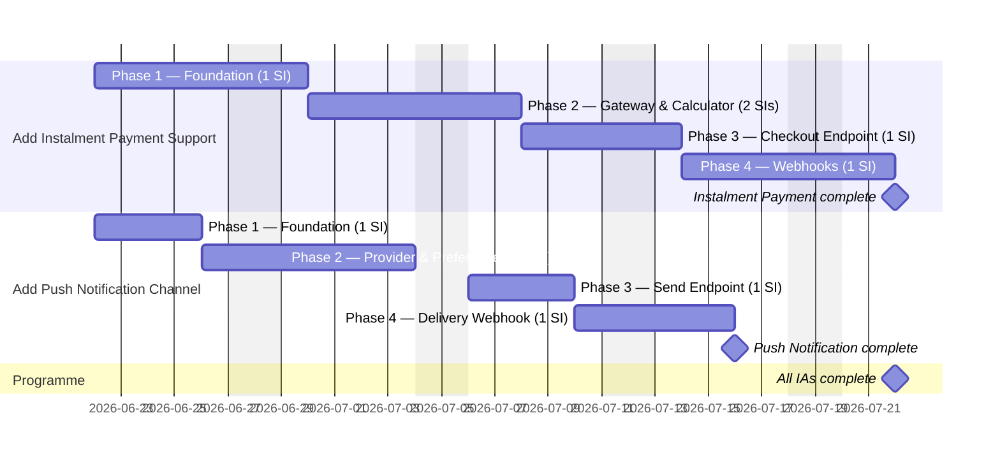

# Delivery Plan

## Capacity model

| T-shirt | Days |
|---------|------|
| XS | 2d |
| S | 4d |
| M | 6d |
| L | 10d |
| XL | 16d |

Durations are derived from **story estimates** (Phase 4), not IA estimates. Phases run in parallel within each stream. Start date: **2026-06-22**.

---

---

## Critical path

The critical path runs through the **Add Instalment Payment Support** epic, which is the longer of the two parallel streams:

1. **SI-01** — Foundation: 6d
2. **SI-02** (parallel with SI-03, SI-02 is the longer): 6d
3. **SI-04** — Checkout endpoint: 4d
4. **SI-05** — Webhooks: 6d

**Total critical path: 22 working days** (from 2026-06-22).

The Add Push Notification Channel stream completes in 18 working days and is not on the critical path.

---

## Key risks

- **Stripe Instalments account enablement** (Order Phase 2) — if the Stripe account does not have the Instalments product enabled before Phase 2 begins, SI-02 cannot be tested in any environment. This blocks SI-04 and SI-05 and could extend the critical path by a full sprint. Confirm account status before Phase 2 starts.

- **Production migration timing** (Order Phase 1, Notifications Phase 2) — both IAs require schema migrations applied manually to production. If the production apply step is delayed (change freeze, DBA availability), Phase 2+ code cannot go live even when ready. Co-ordinate migration scheduling with the DBA / release team as early as Phase 1.

- **Firebase Admin SDK credentials provisioning** (Notifications Phase 2) — SI-02 requires Firebase credentials in Vault for each environment. If Vault provisioning is delayed, SI-02 cannot be tested end-to-end. This blocks SI-04 and could delay the push stream to match the instalment stream. Raise the Vault request in Phase 1.

- **Rounding parity between calculator and Stripe** (Order Phase 2/3) — if the `InstalmentCalculator` output does not match Stripe's figures to the penny, SI-04's end-to-end tests will fail and the phase will need a rework cycle. This is a design-time risk best mitigated by spiking the rounding algorithm against live Stripe test-mode responses before SI-03 is built.

- **Multi-device token design ambiguity** (Notifications Phase 2, SI-03) — the `push_preferences` table design depends on whether a user can register multiple device tokens. If this is not clarified before SI-03 is started, the schema may need to be revised before SI-04 can be completed. Resolve with the Platform team during Phase 1.
