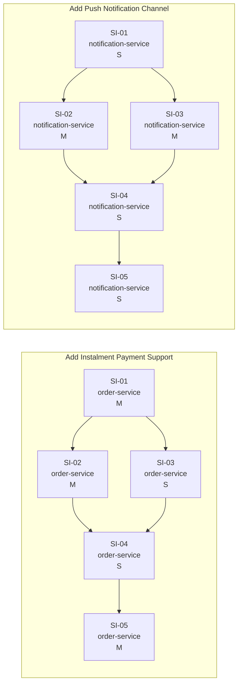

# Consolidated Dependency Graph

## Dependency map (prose)

### Intra-IA edges — order-service-ia

```
order-service-ia SI-01 (order-service) → order-service-ia SI-02 (order-service)
  Reason: SI-02 creates payment intents with instalment schedules; it must type-check
          against the InstalmentPlan domain model introduced by SI-01 and relies on
          the repository layer to persist the gateway reference.

order-service-ia SI-01 (order-service) → order-service-ia SI-03 (order-service)
  Reason: SI-03 returns InstalmentsSchedule domain objects; those types are defined
          in SI-01. Without SI-01 the return type cannot be expressed.

order-service-ia SI-02 (order-service) → order-service-ia SI-04 (order-service)
  Reason: SI-04's checkout handler calls InstalmentGatewayClient.create_instalment_intent,
          which is introduced by SI-02. SI-04 cannot be implemented or tested without it.

order-service-ia SI-03 (order-service) → order-service-ia SI-04 (order-service)
  Reason: SI-04's checkout handler calls InstalmentCalculator to derive the schedule
          before passing it to the gateway. SI-04 cannot be implemented without SI-03.

order-service-ia SI-04 (order-service) → order-service-ia SI-05 (order-service)
  Reason: SI-05 updates instalment schedule records created by SI-04's checkout flow.
          Without SI-04, there are no records to update and no gateway payment intents
          to reconcile against incoming webhook events.
```

### Intra-IA edges — notifications-service-ia

```
notifications-service-ia SI-01 (notification-service) → notifications-service-ia SI-02 (notification-service)
  Reason: SI-02 implements FirebasePushProvider satisfying the PushProvider interface
          introduced in SI-01. Without SI-01 the interface does not exist to implement.

notifications-service-ia SI-01 (notification-service) → notifications-service-ia SI-03 (notification-service)
  Reason: SI-03 extends the preferences API for the push channel. Although it does not
          directly implement the PushProvider interface, it is scoped as a push-channel
          concern and the IA treats SI-01 as the foundational merge point for all push work.

notifications-service-ia SI-02 (notification-service) → notifications-service-ia SI-04 (notification-service)
  Reason: SI-04's send endpoint resolves the push provider via the channel factory.
          The factory must return a real FirebasePushProvider (SI-02) for the endpoint
          to dispatch notifications.

notifications-service-ia SI-03 (notification-service) → notifications-service-ia SI-04 (notification-service)
  Reason: SI-04 must check the recipient's opt-in state from the push_preferences table
          introduced by SI-03 before dispatching. Opt-out enforcement is a hard requirement.

notifications-service-ia SI-04 (notification-service) → notifications-service-ia SI-05 (notification-service)
  Reason: SI-05 updates delivery records written by SI-04's send endpoint. Without SI-04,
          there are no delivery records and no FCM message IDs to match against incoming
          delivery receipts.
```

### Inter-IA edges

No explicit inter-IA dependencies are stated in either IA document. Both epics are part of the same programme (Customer Comms Upgrade), but the dependency from order-service domain events to notification-service dispatch is a downstream consumption relationship (the fulfilment service and notification service consume `order.paid` events) — it is not an implementation dependency between these two epics. The two IAs can be delivered in parallel independent streams.

---

## Mermaid graph


