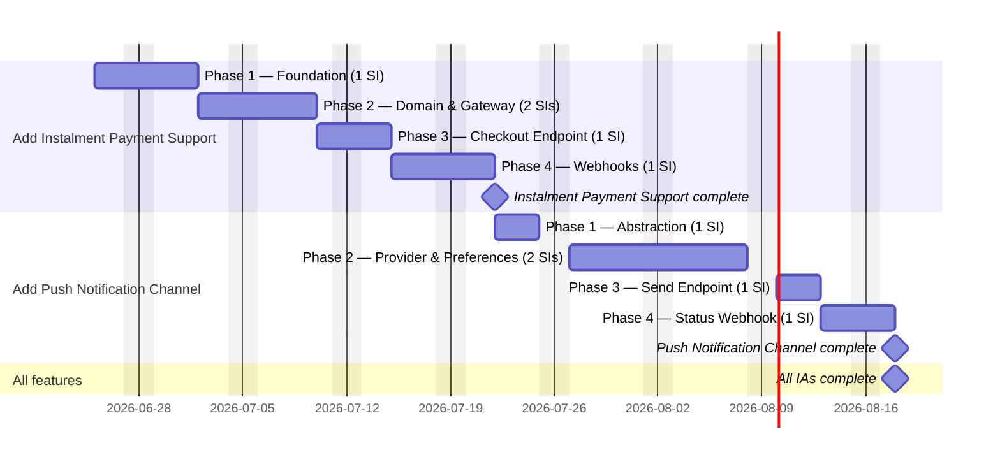

# Delivery Plan — Customer Comms Upgrade

## Capacity model

```
Start date:   2026-06-25
Team:         1 full-stack developer (solo)
Tracks:       1 (all SIs on a single sequential track)
Speedup:      1.0× (N=1, N^0.7 = 1.0 — no parallelism)
Phase timing: Sum of all story estimates within the phase
SIT model:    None
```

## T-shirt to days mapping

| T-shirt | Days |
| ------- | ---- |
| XXS     | 1d   |
| XS      | 2d   |
| S       | 3d   |
| M       | 5d   |
| L       | 8d   |
| XL      | 13d  |
| XXL     | 21d  |

## Phase durations

### Add Instalment Payment Support (order-service-ia)

IA delivery order: 1st — highest risk (Stripe account prerequisite, financial precision requirements).

| Phase | SIs | Story estimates | Phase duration |
| ----- | --- | --------------- | -------------- |
| Phase 1 — Foundation | SI-01 | M=5d | **5d** |
| Phase 2 — Domain & Gateway | SI-03 (S=3d), SI-02 (S=3d) | 3+3 | **6d** |
| Phase 3 — Checkout Endpoint | SI-04 | S=3d | **3d** |
| Phase 4 — Webhooks | SI-05 | M=5d | **5d** |

Total build: **19 business days**

### Add Push Notification Channel (notifications-service-ia)

IA delivery order: 2nd — lower risk; follows established channel pattern.

| Phase | SIs | Story estimates | Phase duration |
| ----- | --- | --------------- | -------------- |
| Phase 1 — Abstraction | SI-01 | S=3d | **3d** |
| Phase 2 — Provider & Preferences | SI-02 (M=5d), SI-03 (M=5d) | 5+5 | **10d** |
| Phase 3 — Send Endpoint | SI-04 | S=3d | **3d** |
| Phase 4 — Status Webhook | SI-05 | S=3d | **3d** |

Total build: **19 business days**

**Grand total: 38 business days**

---

## Gantt chart



---

## Critical path

The critical path runs through every phase of both IAs sequentially — there is no parallelism on a solo team.

**Instalment epic (19d):**
1. SI-01 Foundation — 5d (root node; blocks all other instalment work)
2. Phase 2 Domain & Gateway — 6d (SI-03 calculator 3d, then SI-02 gateway 3d; both unblock the endpoint)
3. SI-04 Checkout Endpoint — 3d (integration point; blocks webhook work)
4. SI-05 Webhooks — 5d (final async loop; closes the instalment feature)

**Push epic (19d, starts after instalment milestone):**
5. SI-01 Abstraction — 3d (root node; blocks all other push work)
6. Phase 2 Provider & Preferences — 10d (SI-02 Firebase provider 5d, then SI-03 preferences 5d; both unblock the endpoint)
7. SI-04 Send Endpoint — 3d (integration point; blocks status webhook)
8. SI-05 Status Webhook — 3d (closes the push feature)

**Total critical path: 38 business days.** Every SI is on the critical path; with a solo team there is no slack anywhere in the plan.

---

## Key risks

- **Stripe account prerequisite (affects Phase 2, instalment epic):** Stripe Instalments must be enabled on the account before `InstalmentGatewayClient` can be integration-tested. If this is not confirmed before Phase 2 starts, the developer will be blocked mid-phase and Phase 2's 6-day window could extend significantly. Mitigate: confirm account status before starting Phase 1.

- **Stripe webhook registration per environment (affects Phase 4, instalment epic):** `POST /webhooks/stripe/instalment` must be registered in the Stripe dashboard for each environment before end-to-end testing. A missing registration causes silent event loss with no error signal. Mitigate: treat environment registration as a Phase 3 acceptance criterion.

- **Firebase Admin SDK credentials in Vault (affects Phase 2, push epic):** FCM credentials must be provisioned in Vault for dev, staging, and prod before `FirebasePushProvider` can be integration-tested. Credential rotation per environment adds coordination lead time. Mitigate: raise a Vault provisioning request before instalment epic completes (i.e. in parallel with instalment delivery).

- **Penny-rounding match between calculator and gateway (affects Phase 2–3, instalment epic):** `InstalmentCalculator` output must match Stripe's figures to the nearest penny. A silent discrepancy will cause checkout rejections that are hard to diagnose. Mitigate: obtain a sample set of Stripe-calculated schedules during SI-02 development and use them as regression fixtures for SI-03.

- **Event schema conformance across both services (affects Phase 4 of both epics):** Both `instalment.paid`/`instalment.failed` (order-service) and the push delivery status events (notification-service) must conform to their respective versioned schemas. A schema mismatch is a runtime failure invisible at build time. Mitigate: extend and review schema files at the start of each Phase 4, not during implementation.
