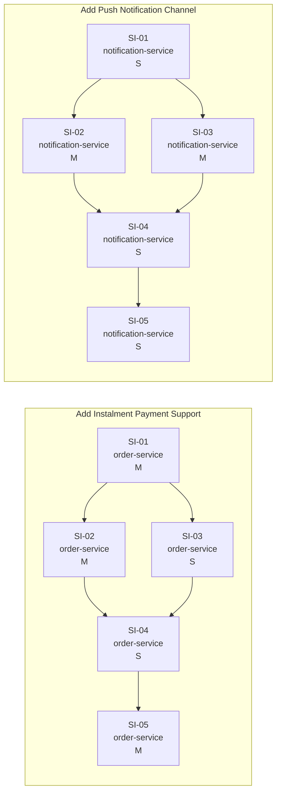

# Consolidated Dependency Graph

## Dependency map (prose)

### Intra-IA edges — order-service-ia

- order-service-ia SI-01 (order-service) → order-service-ia SI-02 (order-service)
  Reason: `InstalmentGatewayClient` accepts `InstalmentPlan` domain types and persists gateway references via `InstalmentRepository`, both introduced in SI-01.

- order-service-ia SI-01 (order-service) → order-service-ia SI-03 (order-service)
  Reason: `InstalmentCalculator` returns `InstalmentSchedule` instances defined in SI-01's domain model layer.

- order-service-ia SI-02 (order-service) → order-service-ia SI-04 (order-service)
  Reason: The checkout endpoint calls `InstalmentGatewayClient.create_instalment_intent()` from SI-02.

- order-service-ia SI-03 (order-service) → order-service-ia SI-04 (order-service)
  Reason: The checkout endpoint calls `InstalmentCalculator.calculate()` from SI-03.

- order-service-ia SI-04 (order-service) → order-service-ia SI-05 (order-service)
  Reason: The webhook handler looks up `InstallmentSchedule` rows by gateway ID — these rows are created by the checkout endpoint in SI-04. Without SI-04, there are no schedules to update.

### Intra-IA edges — notifications-service-ia

- notifications-service-ia SI-01 (notification-service) → notifications-service-ia SI-02 (notification-service)
  Reason: `FirebasePushProvider` implements the `PushProvider` interface defined in SI-01. Without the interface, the provider has no contract and cannot be registered in the factory.

- notifications-service-ia SI-01 (notification-service) → notifications-service-ia SI-03 (notification-service)
  Reason: SI-03 adds `push_preferences` storage that is logically part of the push channel established by SI-01's factory registration. The factory must know `'push'` is a valid channel before preferences can be meaningfully associated.

- notifications-service-ia SI-02 (notification-service) → notifications-service-ia SI-04 (notification-service)
  Reason: The send endpoint resolves the push provider via the factory (SI-01) and calls `provider.send()` — `FirebasePushProvider` from SI-02 is the concrete implementation that must exist.

- notifications-service-ia SI-03 (notification-service) → notifications-service-ia SI-04 (notification-service)
  Reason: The send endpoint calls `getPushPreference(userId)` to enforce opt-out. The `push_preferences` table and query helper from SI-03 must exist.

- notifications-service-ia SI-04 (notification-service) → notifications-service-ia SI-05 (notification-service)
  Reason: The status webhook updates delivery records created by SI-04 dispatches. Without SI-04, there are no delivery records to update.

### Inter-IA edges

There are no inter-IA dependency edges. `order-service` and `notification-service` are independent services. Neither IA's delivery depends on the other's completion; they share no data contracts or domain events at the point of delivery. The two IAs are sequenced in the delivery plan by risk ordering, not by technical dependency.

---

## Mermaid graph

